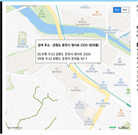

<h5>웹서버구축 프로젝트</h5>
<h1>주말, 공휴일 진료기관 진료정보 안내 사이트</h1>

필수 적용 기술 : 자바빈즈, 데이터베이스  
특이사항 : 1인 프로젝트

<h2>주요 개발 내용 요약</h2>
 
<h4>프로그램 진행</h4>
1. 사용자가 지역선택과 검색어 입력 또는 사용자의 위치와 검색어 입력 
2. 지역을 데이터베이스에 저장된 시도코드, 시군구코드로 변환 
3. 입력데이터와 코드를 통해 API 1을 호출하여 조건에 맞는 병원들의 정보를 받아옴 
4. API 1의 반환된 정보와 요양기호를 통해 반환된 API 2의 정보를 출력테이블에 출력 
5. API 1의 반환값 중 주소를 이용하여 출력테이블의 ‘위치보기’ 버튼을 누르면 지도에 위치 표시 

<h3>0. 사전 설명</h3>
 - 요양기호 : 병원을 구분하기 위해 모든 병원에 부여된 인식기호 
 - 시도코드, 시군구코드 : 지역을 구분하기 위해 지역별 숫자코드 
 - API 1: 시도코드, 시군구코드, 검색어 또는 위치, 반경, 검색어로 호출 병원명, 주소, 요양기호 반환 
 - API 2: 요양기호로 호출, 해당 병원에 대한 휴일 진료정보 반환 

<h3>1. 개발 배경</h3>
 진료기관의 진료시간은 학교와 직장 시간인 오전 9시부터 오후 6시인 경우가 대부분이므로, 일반적으로 진료를 보기 위해서는 조퇴 또는 외출을 통해야만 진료를 볼 수 있습니다.
 또한, 네이버와 구글과 같은 검색엔진에서는 병원의 위치와 병원별 진료시간을 알려주지만, 특정 지역 또는 사용자 주위 병원들의 휴일 진료시간을 한눈에 알기 어렵습니다.
 이러한 이유로 주말, 공휴일에 진료를 받으려는 사람들에게 편의성을 제공하기 위해 개발하였습니다.

<h3>2. 개발 내용</h3>
<h4>프로그램 진행</h4>
<b>1. 사용자가 지역선택과 검색어 입력 또는 사용자의 위치와 검색어 입력</b> 
  - form으로 사용자 입력을 받아 search.jsp 또는 searchUserPos.jsp로 데이터를 넘겨줌 
<b>2. 지역을 데이터베이스에 저장된 시도코드, 시군구코드로 변환</b> 
  - dbconn.jsp의 내용을 통해 DB와 연결하고 SQL을 통해 지역에 맞는 코드를 받아옴 
<b>3. 입력데이터와 코드를 통해 API 1을 호출하여 조건에 맞는 병원들의 정보를 받아옴</b> 
  - 전달받은 데이터로 URL을 작성하여 API 1호출 
  - 반복문을 통해 조건에 맞는 병원들의 정보인 병원명, 주소, 요양기호를 받아옴 
<b>4. API 1의 반환된 정보와 요양기호를 통해 반환된 API 2의 정보를 출력테이블에 출력</b> 
  - API 1의 요양기호로 자바빈즈를 통해 API 2를 호출하여 휴일 진료 여부 정보를 받아옴 
  - API 1의 정보와 API 2의 정보를 테이블에 출력 
<b>5. API 1의 반환값 중 주소를 이용하여 출력테이블의 ‘위치보기’ 버튼을 누르면 지도에 위치표시</b> 
  - 테이블에 출력하면서 버튼에 각 병원의 주소를 매개변수로 호출하는 스크립트 함수를 연결 
  - 버튼을 누르면 main_default.jsp에 있는 자바 스크립트 함수를 통하여 지도에 위치 표시 
<h4>파일 설명</h4>
<table>
 <thead>
  <th>파일명</th><th>설명</th>
 </thead>
 <tbody>
  <tr>
   <td>search.jsp</td>
   <td>사용자의 지역선택, 검색어로 API 1을 호출하여 테이블에 출력</td>
  </tr>
  <tr>
   <td>searchUserPos.jsp</td>
   <td>사용자의 위치, 검색어로 API 1을 호출하여 테이블에 출력</td>
  </tr>
  <tr>
   <td>dbconn.jsp</td>
   <td>데이터베이스를 호출하기 위한 내용이 들어있는 파일</td>
  </tr>
  <tr>
   <td>design_default.jsp</td>
   <td>전체 웹페이지의 기본 디자인이 담겨있는 파일폰트, 메뉴바, 헤더의 내용과 디자인이 있음</td>
  </tr>
  <tr>
   <td>main_defalt.jsp</td>
   <td>main.jsp, search.jsp, searchUserPos.jsp 의 공통된 부분의 디자인과 기능이 담겨있는 파일 
지도, 검색폼, 사용자의 위치, 출력 테이블의 기능과 디자인이 있음</td>
  </tr>
  <tr>
   <td>main.jsp</td>
   <td>기본 웹페이지</td>
  </tr>
  <tr>
   <td>extraCharge.jsp</td>
   <td>좌측 메뉴바의 ‘할증 안내’를 누르면 나오는 페이지 
병원과 약국의 할증정보를 출력함</td>
  </tr>
  <tr>
   <td>outline.jsp</td>
   <td>좌측 메뉴바의 ‘프로젝트 개요’를 누르면 나오는 페이지 
본 프로젝트의 개요를 출력함</td>
  </tr>
  <tr>
   <td>ApiBean.java</td>
   <td>요양기호로 API 2를 호출하는 함수가 있는 자바빈즈 
매개변수: 요양기호 
반환값: 일요일 휴진안내, 공휴일 휴진안내</td>
  </tr>
  <tr>
   <td>데이터베이스</td>
   <td>각 지역의 시도코드, 시군구코드 저장 
   <table>
    <thead>
      <tr>
        <th>설명</th>
        <th>이름</th>
        <th>타입</th>
        <th>예시데이터</th>
      </tr>
    </thead>
    <tbody>
      <tr>
        <td>시도코드</td>
        <td>sidoCd</td>
        <td>varChar(6)</td>
        <td>320000</td>
      </tr>
      <tr>
        <td>시도이름</td>
        <td>sidoCdNm</td>
        <td>varchar(150)</td>
        <td>강원</td>
      </tr>
      <tr>
        <td>시군구코드</td>
        <td>dgguCd</td>
        <td>varchar(6)</td>
        <td>320100</td>
      </tr>
      <tr>
        <td>시군구이름</td>
        <td><b>cgguCdNm</b></td>
        <td>varchar(150)</td>
        <td>강릉시</td>
      </tr>
    </tbody>
    </table>
   </td>
  </tr>
 </tbody>
</table>

<h4>파일 include 구조</h4>

<h3>3. 구현결과</h3>
<table>
<tbody>
  <tr>
    <td></td>
    <td><b>기본 페이지</b> 
        주말, 공휴일 진료유무 데이터가 있는 경우만 표시: 
        모든 병원이 API 2의 정보에 있는 것이 아님 
        체크: API 2에 정보가 있는 경우만 
        체크해제: 조건의 맞는 모든 병원 </td>
  </tr>
  <tr>
    <td></td>
    <td><b>지역별 검색(체크박스 체크해제, 지역만 선택)</b> 
        search.jsp 
        (춘천시의 모든 병원)</td>
  </tr>
  <tr>
    <td></td>
    <td><b>지역별 검색(지역만 선택하여 검색)</b> 
        search.jsp 
        (춘천시의 병원)</td>
  </tr>
  <tr>
    <td></td>
    <td><b>지역별 검색(지역과 검색어를 통해 검색)</b> 
        search.jsp 
        (병원명에 ‘치과’가 들어있는 춘천시의 병원)</td>
  </tr>
  <tr>
    <td></td>
    <td><b>현재위치로 검색(검색어 X)</b> 
        searchUserPos.jsp 
        (사용자의 반경 1000m 이내의 병원)</td>
  </tr>
  <tr>
    <td></td>
    <td><b>현재위치로 검색(검색어 O)</b> 
        searchUserPos.jsp 
        (사용자의 반경 2000m 이내의 병원명에 ‘치과’    가 들어간 병원)</td>
  </tr>
  <tr>
    <td></td>
    <td><b>“위치보기”버튼누르면 지도에 표시</b> 
        search.jsp  searchUserPos.jsp 
        (’e조은치과의원‘의 위치 표시)</td>
  </tr>
  <tr>
    <td></td>
    <td><b>할증안내</b> 
        extra_charge.jsp 
        병원과 약국의 할증정보</td>
  </tr>
  <tr>
    <td></td>
    <td><b>프로젝트 개요</b> 
        outline.jsp 
        본 프로젝트의 개요를 출력함</td>
  </tr>
</tbody>
</table>
<h3>4. 기대효과</h3>
1. 주말, 공휴일에 진료를 원하는 경우, 진료하는 진료기관들을 한눈에 쉽게 확인 가능 
2. 지도에 위치를 출력하여 사용자가 진료기관의 위치를 지도에서 확인 할 수 있음 
<h3>5. 참고자료</h3>
 API 1 - https://www.data.go.kr/data/15001698/openapi.do 
 API 2 – https://www.data.go.kr/data/15001699/openapi.do – 목록:세부정보 
 네이버 지도 - https://navermaps.github.io/maps.js/docs/tutorial-digest.example.html 
 자바빈즈 – https://velog.io/@always/%EC%9E%90%EB%B0%94-%EB%B9%88%EC%A6%88-Java-Beans 
 XML 뷰어 – https://codebeautify.org/xmlviewer 
 할증안내 – http://www.hira.or.kr/dummy.do?pgmid=HIRAA020033000000#none - 가산제도 

<h2>아쉬운점</h2>
 - 데이터를 검색할때마다 API를 통해 받아오는것이 아닌 데이터베이스에 저장해서 검색했으면, 더 많은 검색조건을 만들 수 있었을것이며 속도도 향상됬을것임
 - 네이버 지도 API에 길찾기 내용을 지도위에 출력하는 기능이 없는점이 아쉬움
 - 휴진이 아닌곳만 출력되도록 하고 싶었지만, 병원별로 데이터가 '휴진','전부휴진' 등 통일화가 되있지 않아서 미구현
 - 토요일 휴진 내역을 API가 제공하지 않음
